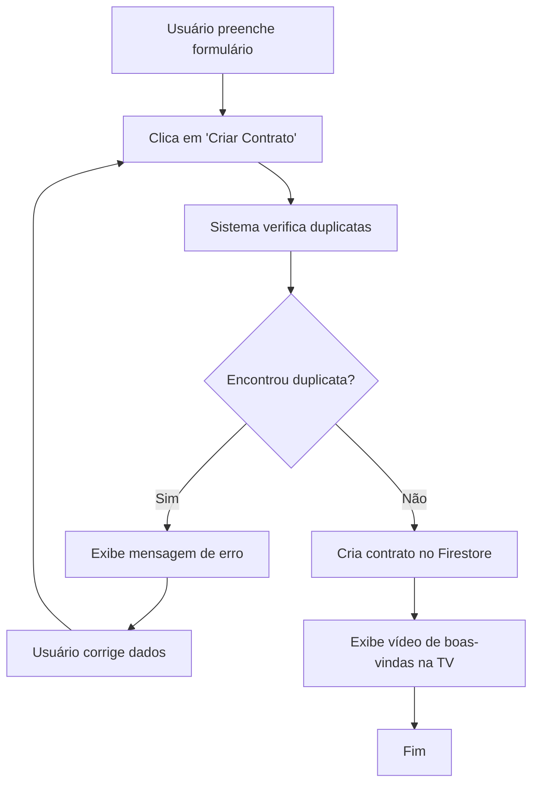

# Validação de Duplicatas de Contratos

## 📋 Visão Geral

O sistema agora possui validação automática para evitar cadastro de contratos duplicados baseado na combinação de **Razão Social** e **Nome Fantasia**.

## 🔍 Como Funciona

### Critério de Duplicata
Um contrato é considerado duplicado quando **AMBOS** os campos são idênticos (ignorando maiúsculas/minúsculas):
- `razaoSocial` (Razão Social)
- `nomeFantasia` (Nome Fantasia)

**Exemplos de duplicatas:**
- "Empresa ABC" = "empresa abc" = "EMPRESA ABC"
- "Teste5" = "teste5" = "TESTE5"

### Fluxo de Validação
1. **Usuário preenche o formulário** com os dados do contrato
2. **Clica em "Criar Contrato"**
3. **Sistema verifica duplicatas** consultando o Firestore
4. **Se encontrar duplicata**: Exibe mensagem de erro e impede o cadastro
5. **Se não encontrar**: Prossegue com o cadastro normalmente

## 🛠️ Implementação Técnica

### Arquivo Modificado
- `src/components/custom/NovoContratoModal.tsx`

### Função de Verificação
```typescript
const checkForDuplicates = async (razaoSocial: string, nomeFantasia: string): Promise<boolean> => {
  try {
    // Normalizar os valores para comparação case-insensitive
    const normalizedRazaoSocial = razaoSocial.trim().toLowerCase()
    const normalizedNomeFantasia = nomeFantasia.trim().toLowerCase()

    // Buscar todos os contratos e filtrar no cliente (Firestore não suporta consultas case-insensitive)
    const allContratos = await contratoService.getAll()

    // Verificar duplicatas com comparação case-insensitive
    const duplicateExists = allContratos.some(contrato => {
      const existingRazaoSocial = contrato.razaoSocial.toLowerCase()
      const existingNomeFantasia = contrato.nomeFantasia.toLowerCase()
      
      return existingRazaoSocial === normalizedRazaoSocial && 
             existingNomeFantasia === normalizedNomeFantasia
    })

    return duplicateExists
  } catch (error) {
    console.error('Erro ao verificar duplicatas:', error)
    return false
  }
}
```

### Consulta Firestore
A validação busca todos os contratos e faz comparação case-insensitive no cliente:
```javascript
// 1. Busca todos os contratos
const allContratos = await contratoService.getAll()

// 2. Normaliza os valores de entrada
const normalizedInput = {
  razaoSocial: input.razaoSocial.trim().toLowerCase(),
  nomeFantasia: input.nomeFantasia.trim().toLowerCase()
}

// 3. Compara com cada contrato existente (case-insensitive)
const isDuplicate = allContratos.some(contrato => 
  contrato.razaoSocial.toLowerCase() === normalizedInput.razaoSocial &&
  contrato.nomeFantasia.toLowerCase() === normalizedInput.nomeFantasia
)
```

## 🎨 Interface do Usuário

### Mensagem de Erro
Quando uma duplicata é detectada, o usuário vê:

```
⚠️ Contrato duplicado
Já existe um contrato cadastrado com essa Razão Social e Nome Fantasia 
(independente de maiúsculas/minúsculas). Por favor, verifique os dados.
```

### Comportamento
- ❌ **Botão "Criar Contrato" permanece habilitado** para permitir correção
- ❌ **Modal não fecha** até que os dados sejam corrigidos
- ✅ **Campos permanecem preenchidos** para facilitar edição
- ✅ **Erro desaparece** quando o modal é fechado ou dados são alterados

## 📊 Estrutura dos Dados no Firestore

### Coleção: `contratos`
```javascript
{
  id: "documento_id_automatico",
  razaoSocial: "Exemplo Empresa LTDA",
  nomeFantasia: "Exemplo Fantasia", 
  dataInicioContrato: "2025-08-27",
  userId: "user_id_do_firebase_auth",
  displayedOnTV: false,
  createdAt: timestamp,
  updatedAt: timestamp
}
```

## 🔧 Casos de Uso

### ✅ Permitido (Não é duplicata)
- **Razão Social igual** + **Nome Fantasia diferente**
- **Razão Social diferente** + **Nome Fantasia igual**
- **Ambos diferentes**

### ❌ Bloqueado (É duplicata)
- **Razão Social igual** + **Nome Fantasia igual** (case-insensitive)

**Exemplos de duplicatas bloqueadas:**
- "Empresa ABC" + "Fantasia XYZ" = "empresa abc" + "fantasia xyz"
- "Teste5" + "Nome5" = "TESTE5" + "NOME5"
- "PLBrasil LTDA" + "PLBrasil" = "plbrasil ltda" + "PLBRASIL"

## 🚀 Benefícios

1. **Integridade dos Dados**: Evita registros duplicados no banco
2. **Experiência do Usuário**: Feedback imediato sobre duplicatas
3. **Eficiência**: Validação rápida antes do cadastro
4. **Flexibilidade**: Permite empresas com nomes similares mas não idênticos

## 🔄 Fluxo Completo



## 🧪 Como Testar

### Teste 1: Duplicata Exata
1. **Criar um contrato** com "Empresa ABC" e "Fantasia XYZ"
2. **Tentar criar outro** com "Empresa ABC" e "Fantasia XYZ"
3. **Verificar** se a mensagem de erro aparece

### Teste 2: Duplicata Case-Insensitive
1. **Criar um contrato** com "Teste5" e "Nome5"
2. **Tentar criar outro** com "TESTE5" e "NOME5"
3. **Verificar** se a mensagem de erro aparece

### Teste 3: Duplicata Mista
1. **Criar um contrato** com "PLBrasil LTDA" e "PLBrasil"
2. **Tentar criar outro** com "plbrasil ltda" e "PLBRASIL"
3. **Verificar** se a mensagem de erro aparece

### Teste 4: Não Duplicata
1. **Criar um contrato** com "Empresa A" e "Fantasia A"
2. **Tentar criar outro** com "Empresa A" e "Fantasia B"
3. **Verificar** que o cadastro funciona normalmente