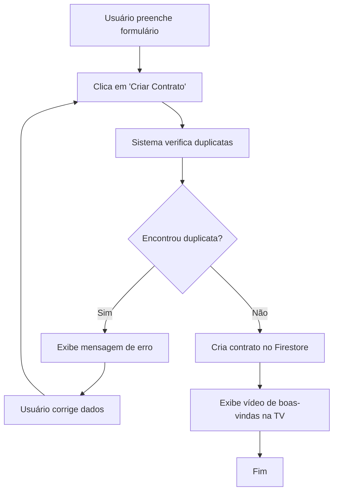

# Validação de Duplicatas de Contratos

## 📋 Visão Geral

O sistema agora possui validação automática para evitar cadastro de contratos duplicados baseado na combinação de **Razão Social** e **Nome Fantasia**.

## 🔍 Como Funciona

### Critério de Duplicata
Um contrato é considerado duplicado quando **AMBOS** os campos são idênticos:
- `razaoSocial` (Razão Social)
- `nomeFantasia` (Nome Fantasia)

### Fluxo de Validação
1. **Usuário preenche o formulário** com os dados do contrato
2. **Clica em "Criar Contrato"**
3. **Sistema verifica duplicatas** consultando o Firestore
4. **Se encontrar duplicata**: Exibe mensagem de erro e impede o cadastro
5. **Se não encontrar**: Prossegue com o cadastro normalmente

## 🛠️ Implementação Técnica

### Arquivo Modificado
- `src/components/custom/NovoContratoModal.tsx`

### Função de Verificação
```typescript
const checkForDuplicates = async (razaoSocial: string, nomeFantasia: string): Promise<boolean> => {
  try {
    const existingContratos = await contratoService.query([
      queryConstraints.where('razaoSocial', '==', razaoSocial.trim()),
      queryConstraints.where('nomeFantasia', '==', nomeFantasia.trim())
    ])

    return existingContratos.length > 0
  } catch (error) {
    console.error('Erro ao verificar duplicatas:', error)
    return false
  }
}
```

### Consulta Firestore
A validação usa uma consulta composta no Firestore:
```javascript
// Busca documentos onde AMBOS os campos são iguais
WHERE razaoSocial == "valor" AND nomeFantasia == "valor"
```

## 🎨 Interface do Usuário

### Mensagem de Erro
Quando uma duplicata é detectada, o usuário vê:

```
⚠️ Contrato duplicado
Já existe um contrato cadastrado com essa Razão Social e Nome Fantasia. 
Por favor, verifique os dados.
```

### Comportamento
- ❌ **Botão "Criar Contrato" permanece habilitado** para permitir correção
- ❌ **Modal não fecha** até que os dados sejam corrigidos
- ✅ **Campos permanecem preenchidos** para facilitar edição
- ✅ **Erro desaparece** quando o modal é fechado ou dados são alterados

## 📊 Estrutura dos Dados no Firestore

### Coleção: `contratos`
```javascript
{
  id: "documento_id_automatico",
  razaoSocial: "Exemplo Empresa LTDA",
  nomeFantasia: "Exemplo Fantasia", 
  dataInicioContrato: "2025-08-27",
  userId: "user_id_do_firebase_auth",
  displayedOnTV: false,
  createdAt: timestamp,
  updatedAt: timestamp
}
```

## 🔧 Casos de Uso

### ✅ Permitido (Não é duplicata)
- **Razão Social igual** + **Nome Fantasia diferente**
- **Razão Social diferente** + **Nome Fantasia igual**
- **Ambos diferentes**

### ❌ Bloqueado (É duplicata)
- **Razão Social igual** + **Nome Fantasia igual**

## 🚀 Benefícios

1. **Integridade dos Dados**: Evita registros duplicados no banco
2. **Experiência do Usuário**: Feedback imediato sobre duplicatas
3. **Eficiência**: Validação rápida antes do cadastro
4. **Flexibilidade**: Permite empresas com nomes similares mas não idênticos

## 🔄 Fluxo Completo



## 🧪 Como Testar

1. **Criar um contrato** com dados únicos
2. **Tentar criar outro contrato** com exatamente a mesma Razão Social e Nome Fantasia
3. **Verificar** se a mensagem de erro aparece
4. **Alterar um dos campos** e tentar novamente
5. **Confirmar** que o cadastro funciona após a alteração